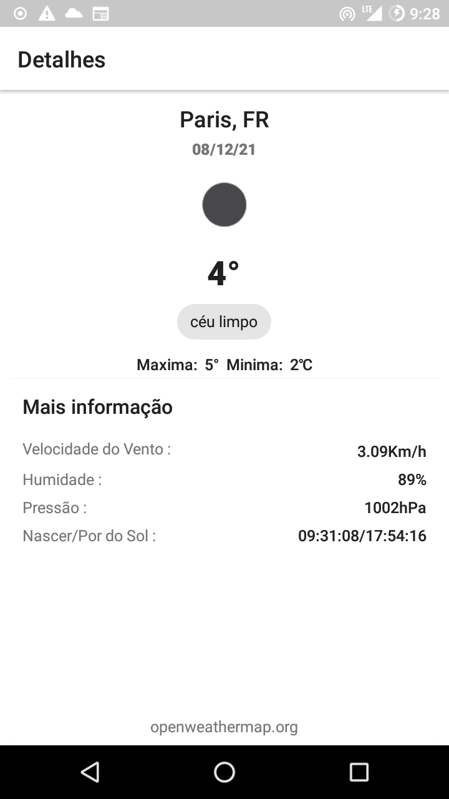

## Weather

This is an Android application that aims to show the current weather status of some cities.

This app
 was developed using the native language for android (java) which gets the data from an API called
 [OpenWeather](https://openweathermap.org/), that provides the weather.

 

##### Aplication Screenshots

|                       Home                        |                        Details                        |
| :------------------------------------------------: | :----------------------------------------------------: |
|  |  |
